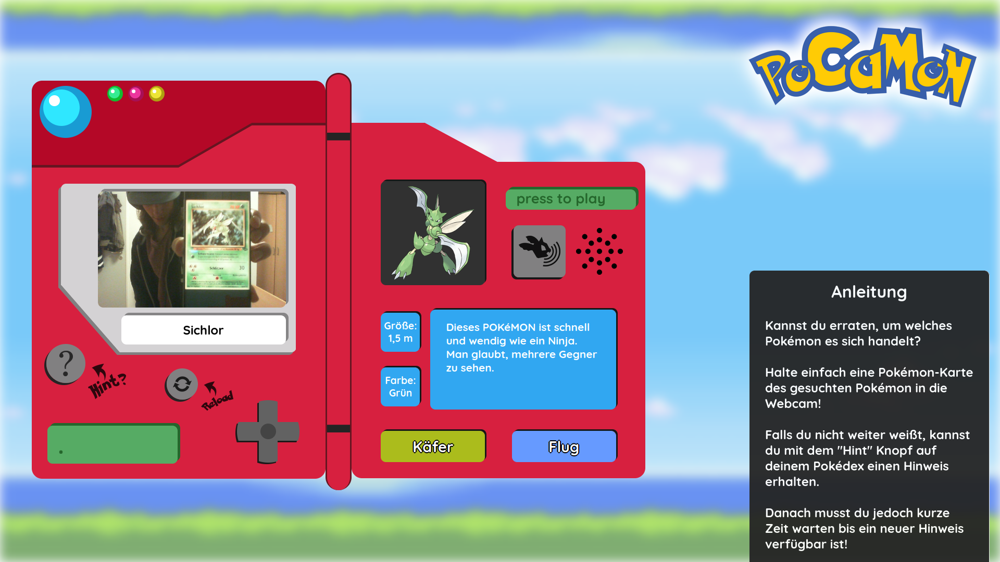
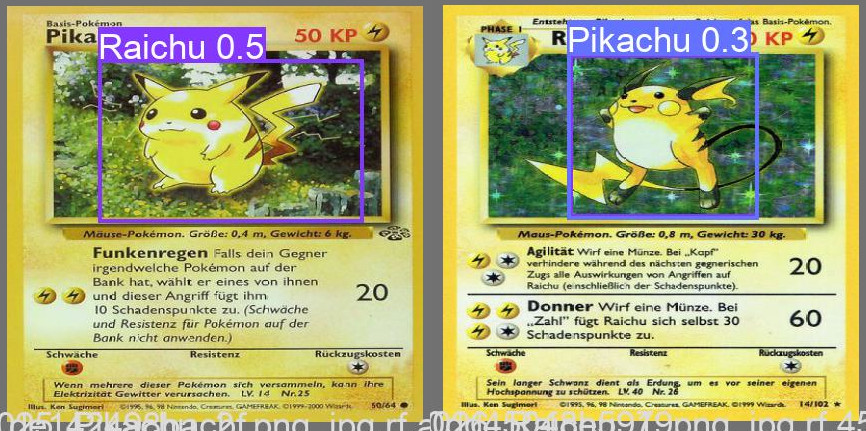

# PoCAMon -- Das Ratespiel, das Pokémon-Karten mit der digitalen Welt vereint

## Fehlende Punkte
- [x] Datenmenge pro Klasse
- [x] Zahl der Epochen im Modelltraining, Lernkurgen, Konfusionsmatrix und Evaluationsergebnisse
- [x] Annotationsrichtlinien
- [ ] Beispielbilder, um Probleme bei der Erkennung zu schildern (Pikachu & Raichu)

## Inhalt:

  - [Spielprinzip](#spielprinzip)
  - [Wie man das Spiel lokal startet](#wie-man-das-spiel-lokal-startet)
  - [Ein Blick hinter die Kulissen: Dokumentation unseres Datenverarbeitungsprozesses](#ein-blick-hinter-die-kulissen-dokumentation-unseres-datenverarbeitungsprozesses)
    - [Zusammensetzung unseres Datensatzes](#zusammensetzung-unseres-datensatzes)
    - [Annitation und Preprocessing](#annitation-und-preprocessing)
    - [Training des Modells](#training-des-modells)

## Spielprinzip

Können Sie erraten, um welches Pokémon es sich handelt? Bei PoCAMon werden Ihnen auf einem virtuellen Pokédex Informationen über ein zufällig ausgewähltes Pokémon angezeigt, anhand denen Spieler das gesuchte Pokémon erraten und eine passende Pokémon-Karte in ihre Webcam halten müssen. Wurde das richtige Pokémon auf dem Webcam-Feed erkannt, geht es weiter mit dem nächsten Pokémon. 

Mit der Zeit werden dem Spieler mehr Hinweise zur Verfügung gestellt, welche er sich über den "Hint" Knopf auf seinen Pokédex laden kann. Darunter befinden sich die Größe und Farbe des gesuchten Pokémon, dessen Typ(en), Pokédex-Eintrag, Ruf (als abspielbaren Sound) und seine Silhouette.

Das Ziel ist es, das gesuchte Pokémon mit möglichst wenigen Hinweisen zu erraten.

## Wie man das Spiel lokal startet

Für PoCAMon stehen derzeit keine plattformspezifischen Builds bereit, daher muss das Spiel direkt über Python gestartet werden:

0. Falls Sie dies noch nicht getan haben, klonen Sie dieses GitLab Repository mit dem Befehl `git clone https://gitlab.hs-anhalt.de/stjtschw/whoami-kilnw.git` und navigieren Sie in den "Server" Ordner innerhalb des Repositories (`cd whoami-kilnw/Server/`).
1. optional aber empfohlenerweise setzen Sie ein virtuelles Python-Environment im "Server" Ordner auf (`python -m venv venv`)
2. Installieren Sie die benötigten Pakete mit dem Befehl `pip install -r requirements.txt`
3. Starten Sie den Webserver mit dem Befehl `flask run`
4. Öffnen Sie im Browser Ihrer Wahl die Adresse http://localhost:5000 und spielen Sie drauf los

---

## Ein Blick hinter die Kulissen: Dokumentation unseres Datenverarbeitungsprozesses

### Zusammensetzung unseres Datensatzes

Eine Objekterkennung für alle 901 bislang existierenden Pokémon zu trainieren hätte vom Zeit- und Arbeitsaufwand unseren Rahmen gesprengt, Letztenendes stellten wir einen Datensatz mit Bildern von 22 Pokémon der ersten Generation zusammen, mit dem wir auch ohne tagelange Trainingssessions akzeptable Ergebnisse erzielen konnten. Welche diese Pokémon sind, können Sie in der Datei Server/data.yaml nachlesen (aber natürlich erst, *nachdem* Sie das Spiel selbst ausprobiert haben :wink:)

Ursprünglich haben wir mittels eines selbst geschriebenen Scrapers für jedes Pokémon für jedes der 151 Pokémon der ersten Generation 15 Pokémon-Karten automatisiert heruntergeladen und annotiert. 

Im öffentlich zugänglichen Datensatz [7,000 Labeled Pokemon](https://www.kaggle.com/lantian773030/pokemonclassification) auf Kaggle fanden wir später zwischen 25 und 50 Bilder zu jedem dieser 22 Pokémon, welche im Training bessere Ergebnisse geliefert haben als der selbst zusammengestellte Datensatz aus Pokémon-Karten. Der gekürzte Kaggle-Datensatz umfasst 670 Trainingsinstanzen, 61 Testinstanzen und 299 Validierungsinstanzen.

### Annotation und Preprocessing

Für diese beiden Aufgaben nahmen wir uns das online-Tool [Roboflow](https://roboflow.com/) zuhilfe, mit dem wir Pokémon auf unseren Bildern mit Bounding Boxes entsprechend dem YOLO v5 PyTorch Annotationsformat markierten. Beim Annotieren der eigens heruntergeladenen Pokémon-Karten haben wir darauf geachtet, immer einen möglichst großen Ausschnitt des Pokémon hervorzuheben, während wir versucht haben, die sich auf den Karten befindlichen Textelemente und Symbole nicht miteinzubeziehen. Insbesondere bei Karten von Megaentwicklungen und EX-Karten stellte sich dies als Herausforderung dar, da in diesen abgebildete Pokémon teils weit über die Grenzen der Abbildungsausschnitts der Karte hinausgehen oder sich gar über die gesamte Karte hinweg erstrecken.
Die Bilder aus dem [7,000 Labeled Pokemon](https://www.kaggle.com/lantian773030/pokemonclassification) Datensatz von Kaggle waren bereits perfekt auf die abgebildeten Pokémon zugeschnitten, diese erneut in Roboflow zu annotieren stellte keine weitere Herausforderung dar.
Wir  und erstellten fünf verschiedene Versionen mit aufsteigend mehr Data Augmentation. In Version 1 wurden die Trainingsbilder lediglich um zufällig zwischen -15° und 15° rotiert, während in Version 5 zusätzlich eine zufällige Scherung um bis zu 20° (sowohl horizontal als auch vertikal), eine Farbtonverschiebung um bis zu 15°, eine Verdunklung oder Aufhellung um bis zu 15% und eine Veränderung der Belichtung um bis zu 15%.
Für jede dieser Datensatzversionierungen ließen wir uns die dreifache Menge an Trainingsbildern generieren, wodurch wir letztenendes mit $ 670 \cdot 5 \cdot 3 = 10050 $ Trainingsdaten trainiert haben.

### Training des Modells

Zum Training und zur Anwendung unseres Modells haben wir uns für die Python-Bibliothek [yolov5](https://github.com/ultralytics/yolov5) entschieden. 
Wir starteten mit einem neu initialisierten neuronalen Netz, für dessen dessen Hyperparameter wir die Voreinstellung [yolov5l.yaml](https://github.com/ultralytics/yolov5/blob/master/models/yolov5l.yaml) verwendet haben. Dieses Modell trainierten wir nacheinander auf jedem der fünf Versionierungen unseres Datensatzes mit ansteigend anspruchsvollerer Data Augmentation, jedes mal für 100 Epochen und mit einer Batch-Size von 6. 

TODO: Diskussion der Ergebnisse

### Aufgetretene Herausforderungen und Schwierigkeiten

Die größte Herausforderung, mit der wir zu kämpfen hatten, war in unserer Aufgabe verwurzelt, Pokémon-Karten erkennen zu wollen. Die Abbildungen auf diesen Karten unterscheiden sich weitreichend in ihren Kunststilen: Ein Pokémon kann auf einer Karte wie in einem Kinderbuch gezeichnet sein, auf einer anderen im Stil eines Ölgemäldes gemalt, auf der nächsten in Form eines schnittigen 3D-Modells im Cel Shading Look präsentiert sein und auf wieder der nächsten photorealistisch gerendert auftreten. Bei Mega-Entwicklungen und dergleichen ändert sich auch gerne mal das Design eines Pokémon. Ebenfalls ändert sich von Bild zu Bild die Pose des Pokémon, die Fordergrun- und Hintergrundgestaltung und manchmal sind sogar mehrere gleiche, in seltenen Fällen auch verschiedene Pokémon auf einer Karte abgebildet. Solche extremen Differenzen erschweren das Lernproblem und erhöhen die Anforderungen an unser Modell erheblich. Wir vermuten, dass dies der Hauptgrund dafür ist, dass manche Pokémon-Karten nicht auf Anhieb oder überhaupt nicht von unserem Modell erkannt werden.

Zeitweise fällt es unserem Modell auch schwer, ähnlich aussehende Pokémon auseinanderzuhalten. Zum Beispiel werden Pikachu und Raichu gerne mal vertauscht (siehe unten)

Mit Roboflow, dem Annitationstool unserer Wahl, wurden nach einiger Zeit leichte Symptome eines Vendor Lock-In spürbar: Man konnte mit dieser App scheinbar keine randomisierte Aufteilung in Trainings- Test- und Validierungsdaten vornehmen, was uns die validierung unserer nach Pokßemon sortierten Datensätze erschwert hat.

Das Bisasam Plüschtier eines unserer Mitglieder wurde übrigens leider nicht als Bisasam erkannt.