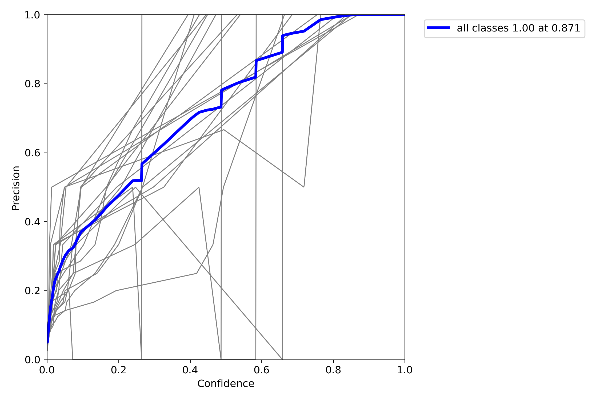
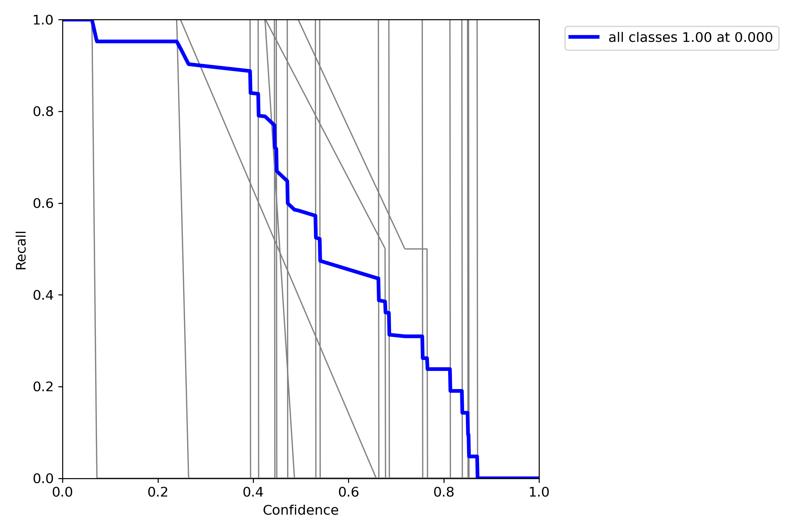
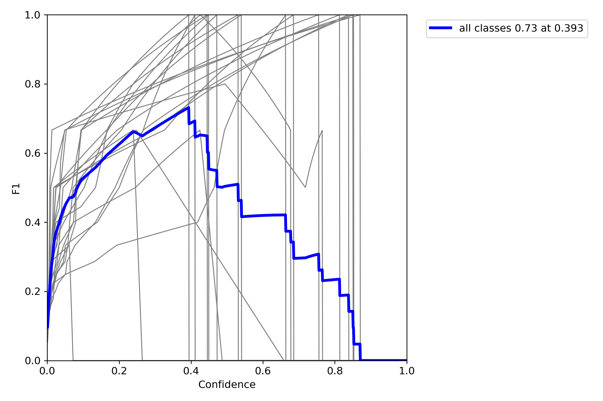
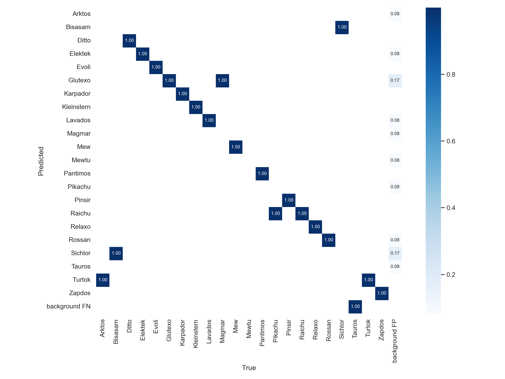

# PoCAMon: Das Ratespiel, das Pokémon-Karten mit der digitalen Welt vereint

## Inhalt:

  - [Spielprinzip](#spielprinzip)
  - [Wie man das Spiel lokal startet](#wie-man-das-spiel-lokal-startet)
  - Ein Blick hinter die Kulissen: Dokumentation unseres Datenverarbeitungsprozesses
    - [Zusammensetzung unseres Datensatzes](#zusammensetzung-unseres-datensatzes)
    - [Annitation und Preprocessing](#annotation-und-preprocessing)
    - [Training des Modells](#training-des-modells)

## Spielprinzip

Können Sie erraten, um welches Pokémon es sich handelt? Bei PoCAMon werden Ihnen auf einem virtuellen Pokédex Informationen über ein zufällig ausgewähltes Pokémon angezeigt, mit denen Spieler das gesuchte Pokémon erraten und eine passende Pokémon-Karte in ihre Webcam halten müssen. Wurde das richtige Pokémon auf dem Webcam-Feed erkannt, geht es weiter mit dem nächsten Pokémon. 

Mit der Zeit werden dem Spieler mehr Hinweise zur Verfügung gestellt, welche er sich über den "Hint" Knopf auf seinen Pokédex laden kann. Darunter befinden sich die Größe und Farbe des gesuchten Pokémon, dessen Typ(en), Pokédex-Eintrag, Ruf (als abspielbaren Sound) und seine Silhouette.

Das Ziel ist es, das gesuchte Pokémon mit möglichst wenigen Hinweisen zu erraten.

## Wie man das Spiel lokal startet

Für PoCAMon stehen derzeit keine plattformspezifischen Builds bereit, daher muss das Spiel direkt über Python gestartet werden:

0. Falls Sie dies noch nicht getan haben, klonen Sie dieses GitLab Repository mit dem Befehl `git clone https://github.com/JustinSchweiger/PoCAMon.git` und navigieren Sie in den "Server" Ordner innerhalb des Repositories (`cd PoCAMon/Server/`).
1. optional aber empfohlenerweise setzen Sie ein virtuelles Python-Environment im "Server" Ordner auf (`python -m venv venv`)
2. Installieren Sie die benötigten Pakete mit dem Befehl `pip install -r requirements.txt`
3. Starten Sie den Webserver mit dem Befehl `flask run`
4. Öffnen Sie im Browser Ihrer Wahl die Adresse http://localhost:5000 und spielen Sie drauf los

---

## Ein Blick hinter die Kulissen: Dokumentation unseres Datenverarbeitungsprozesses

### Zusammensetzung unseres Datensatzes

Eine Objekterkennung für alle 901 bislang existierenden Pokémon zu trainieren hätte vom Zeit- und Arbeitsaufwand unseren Rahmen völlig gesprengt. Aus diesem Grund wollten wir ursprünglich alle 151 Pokémon der ersten Generation in PoCAMon einbauen, letztenendes konnten wir erst nach einer Reduktion auf 22 ausgewählte Pokémon der ersten Generation  akzeptable Ergebnisse erzielen. Welche diese Pokémon sind, können Sie in der Datei Server/data.json in diesem Repository nachlesen (aber natürlich erst, *nachdem* Sie das Spiel selbst einmal ausprobiert haben :wink:)

Zu Beginn des Projekts haben wir einen Scraper für [Pokéwiki](https://www.pokewiki.de) entwickelt, welcher für jedes der 151 Pokémon aus der ersten Generation zusätzlich zu den in PoCAMon als Hinweise verwendeten Metadaten je 15 Pokémon-Karten automatisiert herunterlädt. 
Zusätzlich dazu haben wir uns auch mit dem öffentlich zugänglichen Datensatz [7,000 Labeled Pokemon](https://www.kaggle.com/lantian773030/pokemonclassification) auf Kaggle beschäftigt,welcher zwischen 25 und 50 im Vorfeld zugeschnittenen Bilder zu jedem Pokémon der ersten Generation enthält.

In der aktuell besten Version unseres Modells wurde der Datensatz von Kaggle nicht verwendet, sondern nur die eigens heruntergeladenen und annotierten Pokémon-Karten. Wir verwendeten insgesamt 325 verschiedene Pokémon-Karten, davon 75 zum Validieren und die restlichen 250 Bilder erweiterten wir über Data Augmentation zu 749 Trainingsdaten. Testdaten verwendeten wir keine, weil wir anstatt selbst eine Hyperparameteroptimierung vorzunehmen die Voreinstellungen für Netzgrößen in yolov5 übernommen haben.

### Annotation und Preprocessing

Für diese beiden Aufgaben haben wir uns das online-Tool [Roboflow](https://roboflow.com/) zuhilfe genommen, mit dem wir Pokémon auf unseren Bildern mit Bounding Boxes entsprechend dem YOLO v5 PyTorch Annotationsformat markiert haben. Beim Annotieren der eigens heruntergeladenen Pokémon-Karten haben wir darauf geachtet, immer einen möglichst großen Ausschnitt des Pokémon hervorzuheben, während wir versucht haben, unpraktisch platzierte Textelemente und Symbole nicht in die annotierten Bereiche miteinzubeziehen. Insbesondere bei Karten von Megaentwicklungen und EX-Karten stellte dies eine Herausforderung dar, da in diesen abgebildete Pokémon teils weit über die Grenzen der Abbildungsausschnitts ihrer Karte hinausgehen oder sich gar von oben bis unten über die gesamte Karte hinweg erstrecken.

Die Bilder aus dem [7,000 Labeled Pokemon](https://www.kaggle.com/lantian773030/pokemonclassification) Datensatz von Kaggle waren bereits perfekt auf die abgebildeten Pokémon zugeschnitten, diese erneut in Roboflow zu annotieren stellte keine weitere Herausforderung dar.

Wir haben bis jetzt immer verschiedene Versionen unserer Datensätze mit unterschiedlichen Bildeffekten zur Data Augmentation erstellt, um unserem Modell in den ersten Durchläufen das Lernen zu erleichtern und es in späteren Durchläufen auf ungünstige Fälle vorzubereiten (zum Beispiel über- oder unterbelichtete Webcams).
Für jede dieser Datensatzversionierungen lassen wir uns die dreifache Menge an ursprünglichen Trainingsbildern generieren. Wie viele Versionierungen pro Datensatz insgesamt erstellt wurden und welche Bildeffekte wann und wie stark ausgewählt wurden entschieden wir nach Gefühl und nach dem Trial and Error Prinzip.  

### Training des Modells

Zum Training und zur Anwendung unseres Modells haben wir uns für die Python-Bibliothek [yolov5](https://github.com/ultralytics/yolov5) entschieden. 
Wir starteten mit einem neu initialisierten neuronalen Netz, für dessen dessen Hyperparameter wir die Voreinstellung [yolov5l.yaml](https://github.com/ultralytics/yolov5/blob/master/models/yolov5l.yaml) verwendet haben. Dieses Modell trainierten wir nach und nach weiter, je 100 Epochen auf einmal, um einem Datenverlust bei Programm- oder Systemabstürzen vorzubeugen. Für jeden dieser Durchläufe ließen wir uns von Roboflow eine Version des Datensatzes mit leicht unterschiedlichen Parametern für die Data Augmentation erzeugen. 

In der Praxis ist unser Modell noch etwas durchwachsen: Einige Pokémon-Karten werden auf Anhieb richtig erkannt, andere erst nach einigen Sekunden und wieder andere überhaupt nicht.

Nach der letzten Trainingssitzung hat yolov5 folgende Validierungsergebnisse aufgezeichnet:

 Precision in Relation zur Confidence | Recall in Relation zur Confidence | F1 Score in Relation zur Confidence  
:---:|:---:|:---:
 |  | 

Angenommen die Validierungsdaten bilden das Lernproblem ausreichend gut ab, lässt sich mit diesem Modell maximal ein F1-Score von 0,7 erreichen bei einer Confidence von 0,4. Diese wird zwar von yolov5 automatisch ins Modell übernommen, allerdings ist 0,7 für einen F1-Score nicht gerade viel. 

Ein Blick auf die Vertauschungsmatrix macht deutlich, dass manche Pokémon konsequent falsch erkannt werden: 

Die dauerhafte Falscherkennung mancher Pokémon-Karten ist auch während während des Playtestings negativ aufgefallen.

### Herausforderungen und Schwierigkeiten

Unsere größte Herausforderung war in unserer Aufgabenstellung verwurzelt, Pokémon-**Karten** automatisiert zu erkennen. Die Abbildungen auf diesen Karten unterscheiden sich auch innerhalb der Klassen weitreichend: Ein Pokémon kann auf einer Karte wie in einem Kinderbuch gezeichnet, auf einer anderen im Stil eines Ölgemäldes gemalt, auf der nächsten in Form eines schnittigen 3D-Modells im Cel Shading Look präsentiert sein und auf wieder der nächsten photorealistisch gerendert auftreten. Bei Mega-Entwicklungen und dergleichen ändert sich auch gerne mal das Design eines Pokémon. Zusätzlich ändert sich von Bild zu Bild die Pose des Pokémon, die Vordergrund- und Hintergrundgestaltung und manchmal sind sogar mehrere gleiche, in seltenen Fällen auch verschiedene Pokémon auf einer Karte abgebildet. Solche extremen Differenzen erschweren das Lernproblem und erhöhen die Anforderungen an unser Modell erheblich. Wir vermuten, dass dies der Hauptgrund dafür ist, dass manche Pokémon-Karten nicht auf Anhieb oder überhaupt nicht von unserem Modell erkannt werden.

Dass uns für das Training nur begrenzt Zeit und die Rechenleistung zur Verfügung standen, stellte eine weitere Hürde dar. Unser Team war zwar mit genügend modernen Gaming-PCs mit CUDA-Support ausgestattet, allerdings hätte das Trainieren von ausreichend komplexen Modellen für alle 151 Pokémon der ersten Generation tagelang gedauert. Aus diesem Grund haben wir uns auf eine Auswahl von 22 zu erratenden Pokémon begrenzt, wodurch wir die Trainingszeiten auf ca. eine Stunde pro 100 Epochen senken konnten.

Zeitweise fällt es unserem Modell schwer, ähnlich aussehende Pokémon auseinanderzuhalten. Paradebeispiele wären Pikachu und Raichu, wie in dieser Abbildung eines Validierungsoutputs einer früheren Version unseres Modells zu sehen ist, allerdings sind auch andere Pokémon mit eher ähnlichen Designs betroffen.

Das Bisasam Plüschtier eines unserer Mitglieder wurde übrigens leider nicht als Bisasam erkannt.
